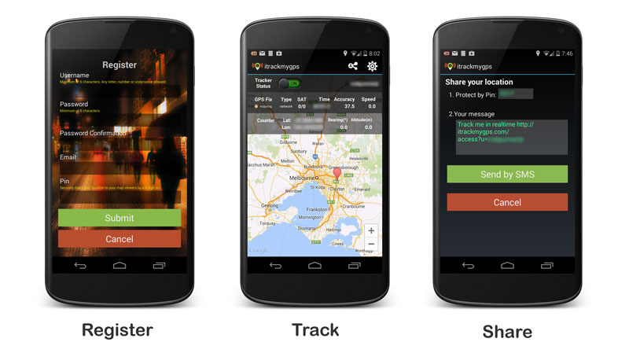

itrackmygps-android
=========



For more info, see <http://itrackmygps.com>

Download from PlayStore https://play.google.com/store/apps/details?id=com.twormobile.itrackmygps

Want to become a tester?
[Google Plus Community "itrackmygps - testers"](https://plus.google.com/communities/100298062955164933715)

# Features

- Logs gps of your Android Device
- Saves gps coordinates to sqlite database on internal storage
- Sends gps coordinates to remote server
- AutoStart on Boot

# Prerequisites
- IntelliJ Idea CE
- Android Platform 15+

# Instructions

- Clone the project `git clone git@github.com:rdeguzman/itrackmygps-android.git`
- Get a google maps API Key.
- Copy `api_key.xml` to `res/values`

	```
	<?xml version="1.0" encoding="utf-8"?>
	<resources>
    	<string name="google_maps_key">Your-GoogleMaps-API-Key</string>
	</resources>	
	```
- Build	and Deploy